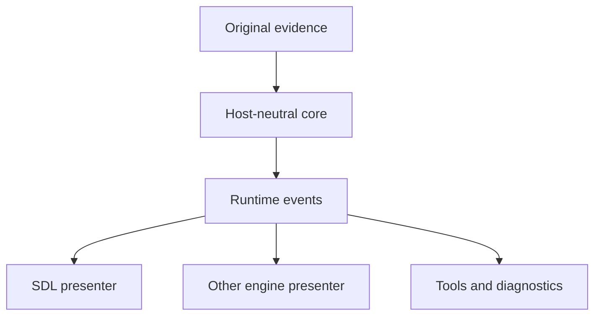
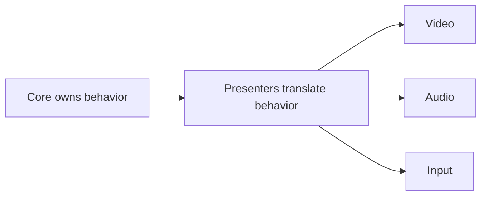

There is a trap in reimplementing an old game. It is very easy to say the word
"faithful" and then quietly build something that only resembles the original from
a comfortable distance.

That is not what this project is trying to do.

The Darklands Restored engine is not a loose remake, and it is not an opportunity to build
a cleaner game now that better tools exist. The goal is more specific and, in
some ways, more demanding: to reconstruct what the original game actually did,
in a form that a modern host can understand and present.

The distinction matters more than it might sound.

## Why behavior, not appearance

A surface-level reimplementation might say: show an intro, play some music, go
to the menu. That is achievable in an afternoon. The result can look convincing
without capturing anything real about the original game.

What the restoration project asks instead is: which files did the game open, and
in what order? Which branch did it take? What did the display contain at each
step? What did the keyboard input actually produce? What portion of an audio
file did the sound system request, and when? What do we know for certain, and
what are we still guessing?

Those are harder questions. They require weeks of runtime observation, format
analysis, and careful study of the game's behavior. But they are the right
questions, because answering them is the only way to build something that
genuinely understands what Darklands was doing rather than something that merely
imitates it from the outside.

## The split that makes this work

It was important to define the architecture from the very start. 
The current architecture divides the project cleanly into two layers.

The core engine owns the behavioral model: the startup sequence, the intro asset
order, frame data, palette data, audio cue identities, input events, and the
distinction between what is confirmed and what is still open. It has no
dependency on any display library. It does not know what a GPU
texture looks like.

The host layer takes the events the core produces and turns them into something
visible and audible. The current host uses SDL2 for easy testing. A future host
could use another engine or frontend. Both would consume the same core events
without requiring the engine to change, making it possible to port the engine to
any other type of frontend host.

This is not a clever abstraction for its own sake. It is what makes the project
viable long-term. The research will keep producing more precise answers about
original behavior, and those answers need somewhere stable to land. If the
display layer and the behavioral model are tangled together, every new discovery
requires untangling them first.

## Architecture as a contract

The important architectural choice is that the core does not present the game.
It describes what the original runtime did.

That means the core is responsible for producing a stream of facts and requests:
a frame is ready, a palette changed, a display boundary was reached, a sampled
audio cue was requested, a startup resource was loaded, a key was interpreted as
an original BIOS input word, or a branch moved execution toward the start
screen.

The presenter is responsible for translating those facts into a modern
environment. The current SDL host turns indexed frames into textures and DGT
windows into queued audio. Another engine host would translate the same events
into its own textures, audio clips, input actions, and scene objects. The core
should not care which host is being used.

This gives the project two different kinds of stability.

The first is research stability. When a runtime trace proves a new detail, that
detail lands in the core as a better event, a better source window, a better
fidelity marker, or a better branch target. It does not require rewriting the
SDL renderer.

The second is presentation stability. If the project later gains a different
frontend, a high-resolution art path, or another audio backend, those systems
translate the same core events. They do not become the source of truth for game
behavior.

A useful way to think about the boundary is this:

The direction matters. Input from a host is translated back into original-style
facts before Core sees it. Output from Core is translated into host-specific
presentation after Core emits it. The core remains the place where original
behavior is reconstructed, and the host remains the place where that behavior is
made visible, audible, and playable on a modern machine.

This is why the project can support replacement assets without becoming a
different game. A future host may choose to show a higher-resolution version of
a screen, or play a cleaner recording of `intro.lightning`, but the decision
that the original runtime requested `intro.lightning` at that point still comes
from Core. The presenter can improve presentation. It does not rewrite history.

## What exists now

The project is currently a .NET 8 solution with a headless core, a tools project, a test
suite, and the SDL host.

I decided to start with the full start-up sequence up to the main menu.

The startup sequence is modeled from the beginning: the text-mode banner that
appears before any graphics are initialized, the configuration file that selects
the sound hardware setup, the loading of graphics support and fonts, the sound
module initialization, and the transition into the intro sequence.



The intro plays all seven original PAN files in the correct order. The display
goes blank, the palette updates, and the next scene appears, in the same pattern
the original game used.





At the end of the intro, the engine lands at the start screen and waits for input.



The PAN decoder was built directly from the format research described in
[devlog #028](/posts/028-the-pan-format-decoded/). It produces frame-by-frame
output that matches the original game's display, verified against captures from
the running game at selected points.

The test suite covers 59 cases: asset ordering, frame counts, event shapes,
specific frame hashes, and the boundary between confirmed behavior and
placeholder estimates.

## Fidelity markers

One of the most useful decisions was to make uncertainty explicit in the code
itself.

Every significant behavior in the core carries a label. Some behavior is
confirmed, meaning it is backed by direct observation of the running game. Some
is strongly supported, meaning multiple sources agree but one detail is still
open. Some is a placeholder, meaning the shape is right but the exact original
behavior is not yet fully understood.

This is not bureaucracy. It is how the project stays honest about what it knows.

The audio side is the clearest example. The file (OPENDARK.DGT) that carries the "Welcome to
Darklands" voice during the intro also contains the bell, the toad, and the
lightning effects heard throughout the sequence. Each of those is a distinct
window within the same raw audio file. The project knows the precise byte offsets and
lengths for each one. 

So the core emits a semantic audio request with an identifier and the original
source window attached. The SDL host can play the original bytes directly. A
future host can map the identifier to a replacement recording. A diagnostic
build can log the original offset. All of them consume the same event. The
placeholder label on the timing is visible in the code, not hidden behind a
comment.

That pattern, preserve the original observation, expose a useful contract, label
what is still open, is the standard the project is trying to hold everywhere.

## What is still ahead

The intro layer is now solid. The start screen is modeled at the top level, with
the three main menu actions confirmed. What happens after each of those choices
is still being mapped. The party creation screen, character generation, city
navigation, and the rest of the game are all separate fronts, each requiring the
same careful observation before any code gets written.

The audio path also needs more work. The scheduler that sequences the sampled
intro effects, even if we now have them correctly mapped to the precise PAN frame,
is not yet fully understood. The intro music layer, which runs
separately from the voice clips, is evidenced but not yet connected to a
specific playback path. This is coming soon.

## The question this project is actually answering

The easy question is whether something can be made that looks like Darklands. It
can.

The harder and more interesting question is whether a modern engine can genuinely
understand what Darklands was doing: which decisions the game made, which files
it touched, which paths it took, and why the screen showed what it showed.

That is what the research earns and what the implementation is trying to
reflect. Every piece of confirmed behavior is backed by a runtime observation or
a decoded format. Every placeholder is labeled as such. Nothing is invented to
fill a gap and then left unmarked.

It is slower than building a remake. It is also the only way to build something
that is actually faithful to the original rather than just reminiscent of it.
